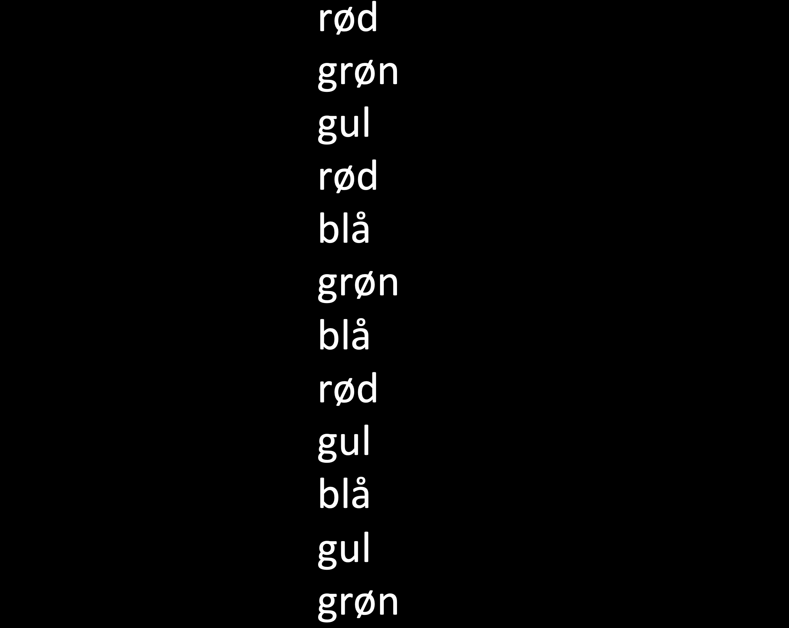
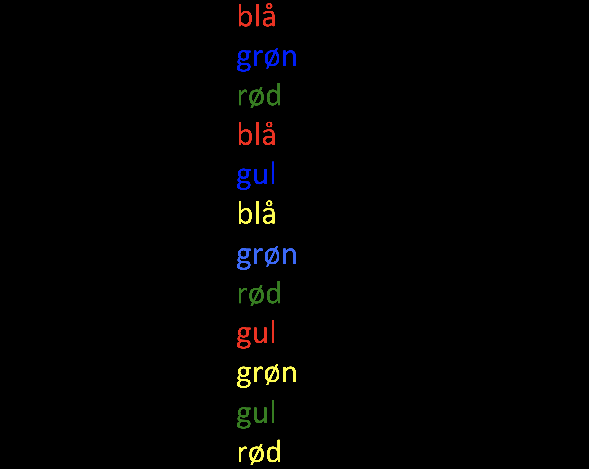
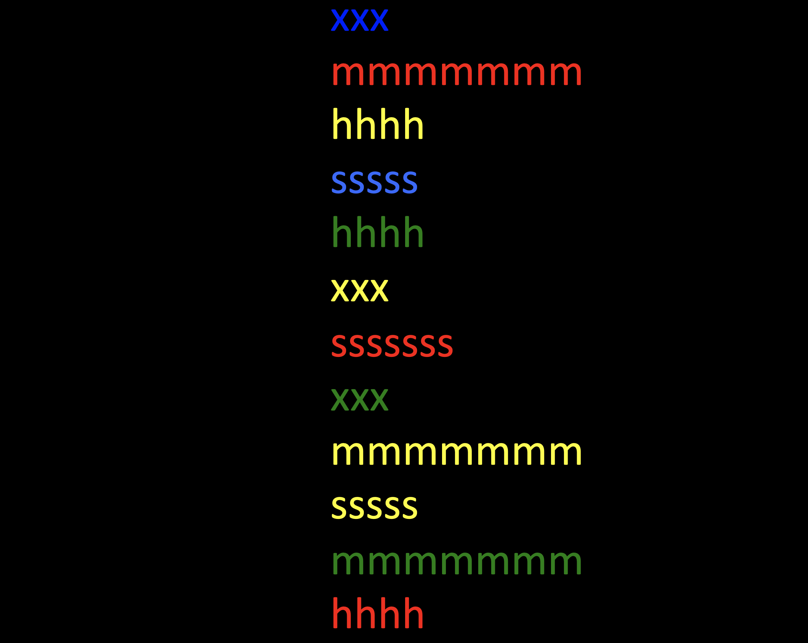
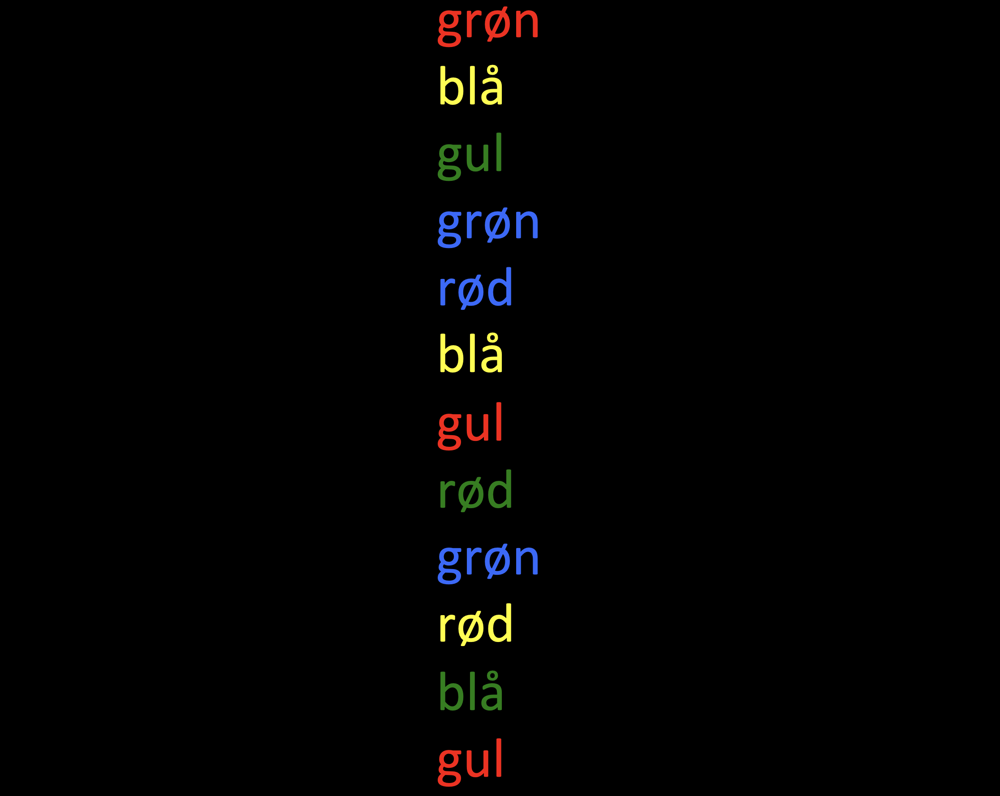

# Data collection: Stroop task

---------------------------------------- 

Each person does all 4 sheets, then on to the next person

1.  Time-taker records time for each whole sheet.
2.  Enter each person’s data in the raw data sheet
3.  Leave room for other groups
4.  Mark if the participant is NOT a native Danish speaker
5.  Add any other notes you might think are relevant
6.  Have fun!

---------------------------------------- 

One the next slide...

read all the words

---------------------------------------- 

---------------------------------------- 

On the next slide...

say the color that the words are printed in

---------------------------------------- 

---------------------------------------- 

On the next slide...

say the color that the symbols are printed in

---------------------------------------- 

---------------------------------------- 

On the next slide...

read all the words

---------------------------------------- 

---------------------------------------- 

